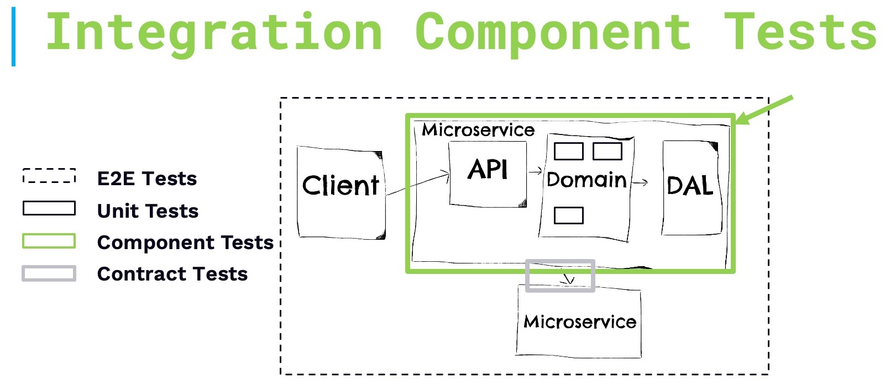

# Full Coverage Testing

Open application at http://localhost:3000/

## 🧪Testing Strategy

| Expected Behavior  | Test Type  | Technologies  |
|---|---|---|
| Application renders  |  |   |
| Learn React link goes to correct location  |   |   |
| Learn React link opens in new tab  |   |   |
| App looks as expected on web and mobile  |   |   |
| Front-end performance is at least a B  |   |   |

## What is the most basic test that we can write for our application?
* How about making sure that our app renders?

`npm run cy:open`

* Delete the content in the the integration folder 
* Add `ui` folder
* Create a new test

```js
/// <reference types="cypress" />
it('loads', ()=> {
    cy.visit('http://localhost:3000')
    cy.get('.App-link').should('be.visible')
})
```

## Does this test guarantee that our app works as expected?

✅ App has corresponding class visible

✅ App renders in UI

❓ Does the app look as intended

❓ Does the app work as intended

🏋️‍♀️ Stop the application and rerun the test

✅Confirms rendering works as expected

### What is the disadvantage of this test?

1. Need a browser
2. Need a server
3. Need to deal with network issues
4. Test will be slower
5. Need an extra dependency (Cypress)
6. Need to learn extra dependency API

## Can we test the same thing more efficiently❓

1. Stop the server
2. Rerun Cypress test
3. ❓Why does the test fail?
4. ❓Does our app still work?

> ❗️ADD A DIAGRAM HERE

## Component tests

There are a few ways to test React components. Broadly, they divide into two categories:

* Rendering component trees in a simplified test environment and asserting on their output.
* Running a complete app in a realistic browser environment (also known as “end-to-end” tests)

[ReactJS.org](https://reactjs.org/docs/testing.html)

### What is a component test?



Source: [Yoni Goldberg](https://github.com/nadvolod/component-tests-workshop/blob/main/graphics/component-diagram.jpg)

Our app was created using `create-react-app`. With this method, we automatically get a few cool things for testing:
* @testing-library
* jest
* And we get an automatic component test in `src/App.test.js`

```js
test('renders learn react link', () => {
  render(<App />);
  const linkElement = screen.getByText(/learn react/i);
  expect(linkElement).toBeInTheDocument();
});
```

**Testing Library** is an opinionated framework that helps with component rendering and interactions.

**Jest** is a test runner and provides a bunch of capabilities like matchers and snapshot testing

### Run the component test

In your current directly, execute `npm run test`. The test should pass, even though our app isn't running.

💡 'p' to filter tests down to a specific file
💡 'o' to run tests only in the changed files

#### ❓What does the component test not validate that our E2E Cypress test did❓

MISSING INSTRUCTIONS

### 💡How to add a test id to our app

We all know that finding something by text sucks. Let's provide a better locator for our app.

1. Go to `App.js`
2. In the `<a>` of the App component add a `data-testid` property

```js
        <a
          className="App-link"
          href="https://reactjs.org"
          target="_blank"
          rel="noopener noreferrer"
          data-testid="learn-link"
        >
```

3. Update the test to have this line of code instead `const linkElement = screen.getByTestId('learn-link');`
4. Save and the test will automatically rerun

#### ❓Is our app fully tested❓

### 🔗Testing links (the right way)

🏋️‍♀️Write a check to test the link
1. Go to `cypress/integration/ui/exercise.spec.js`
2. Write a test for clicking the link

```js
it('should click link',()=>{
     cy.visit('/');
     cy.get('[data-testid='learn-link']').click().url().should('contain','reactjs.org');
 })
```

❓Why is this test bad❓

1. Cypress will never have multi-tab support
2. We should never need to test that a link is clickable, this is the browser's native behavior
3. We should never need to test that a link opens a new tab

🏋️‍♀️Write a test to validate link behavior

💡We don't need a browser to actually test this, so why not use a fast component test?

1. Go to `App.test.js` and write a test that looks like this

```js
test('link has correct url', () => {
  //render our App component in a virtual DOM
  render(<App />);
  //search for an element by text
  const linkElement = screen.getByTestId('learn-link');
  //Using Jest matchers: https://jestjs.io/docs/using-matchers
  expect(linkElement.href).toContain('https://reactjs.org');
})
```
2. Run the test

❓What does this check actually test❓

❓What if we wanted to test that the link opens in a new tab❓

👀 Working with 'target' attribute

🏋️‍♀️Write a component test to validate that link opens in a new tab

❓Is our app fully tested now❓

| Expected Behavior  | Tested? | Test Type  | Technologies  |
|---|---|---|---|
| Application renders  | ✅ | Component | React testing library, Jest |
| Learn React link goes to correct location | ✅ | Component | React testing library, Jest |
| Learn React link opens in new tab  | ✅ | Component | React testing library, Jest |
| App looks as expected on web and mobile  | 🙅‍♂️ |   |   |
| Front-end performance is at least a B  | 🙅‍♂️ |   |   |
| App is secure  | 🙅‍♂️ |   |   |

### Let's go implement [visual testing](./docs/VISUAL.md)