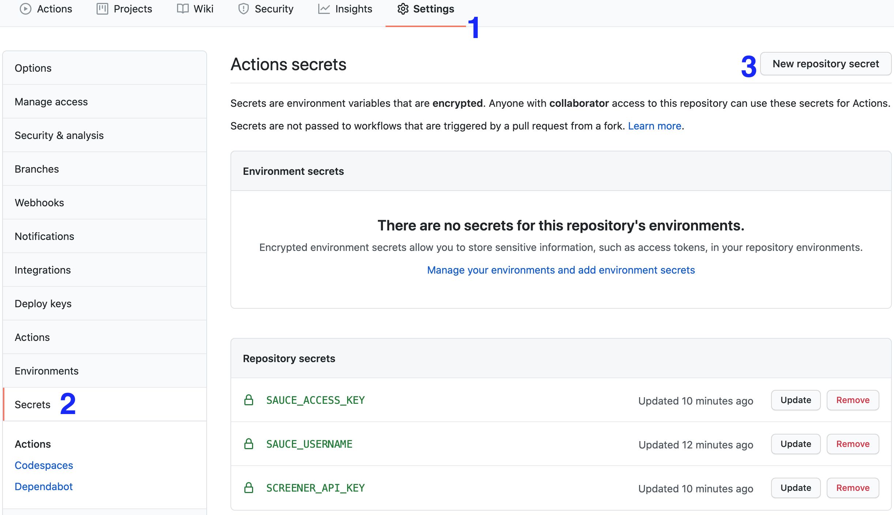

# CICD

## 🏋️‍♀️Let's add this code to our CI system.

1. Create a a file in this folder structure `.github/workflows/ci.yml` in the root of your directory
2. Paste in the following configuration

```yml
name: Node.js CI
env:
  SCREENER_API_KEY: ${{ secrets.SCREENER_API_KEY }}
  SAUCE_USERNAME: ${{ secrets.SAUCE_USERNAME }}
  SAUCE_ACCESS_KEY: ${{ secrets.SAUCE_ACCESS_KEY }}

on:
  push:
    branches: [ main ]
  pull_request:
    branches: [ main ]

jobs:
  build:

    runs-on: ubuntu-latest

    strategy:
      matrix:
        node-version: [14.x]

    steps:
    - uses: actions/checkout@v2
    - name: Use Node.js ${{ matrix.node-version }}
      uses: actions/setup-node@v1
      with:
        node-version: ${{ matrix.node-version }}
    - name: Install dependencies 📦
      #Using npm ci is generally faster than running npm install
      run: |
        cd my-react-app
        npm ci
    - name: Build the app 🏗
      run: |
        cd my-react-app
        npm run build
    - name: Run component tests 🔸
      run: |
        cd my-react-app
        npm run test
    - name: Start the app 📤
      run: |
        cd my-react-app
        npm start &
        npx wait-on --timeout 60000
    - name: Run functional UI tests 🖥
      run: |
        cd my-react-app 
        npm run cy:ci
    - name: Run visual tests 👁
      run: |
        cd my-react-app
        echo $SAUCE_USERNAME
        npm run test:visual
```
3. Add New repository secrets for the repo



4. `git push` and watch it run

## Front-end performance

* Use the task tracker application that we build in React JS crash course
* Get the performance metrics by using <a> in the About and Footer components
* Then change those to a Link component
* Then recapture the front-end perf metrics
* The expected result is that with the instant DOM refresh, the latter will be faster